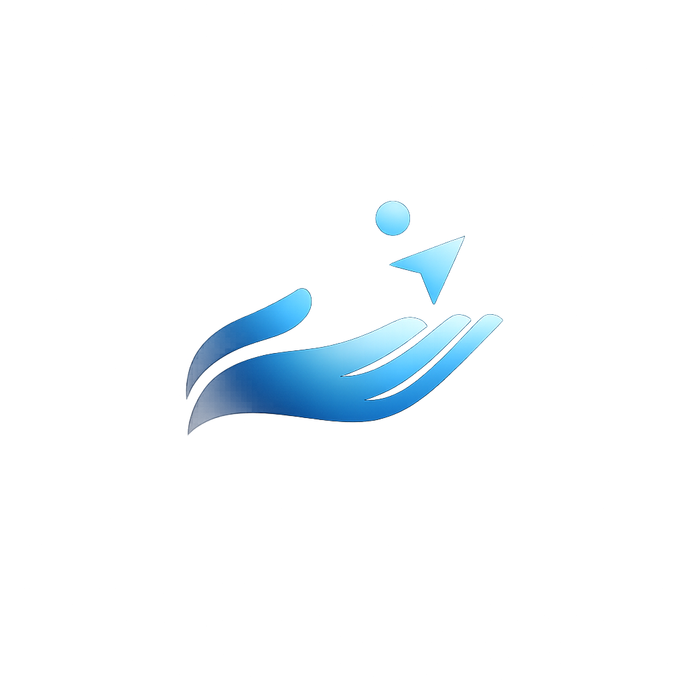

<p align="center">
  
</p>

<h2 align="center">Gesture Control System (GCS)</h2>

<p align="center">
  <strong>Touch-free computer control using hand gestures and computer vision.</strong>
</p>

<p align="center">
  
  
  
  
</p>

---

## Demo

<p align="center">
  
</p>

---

## Description

Gesture Control System (GCS) is a Python-based human–computer interaction system that enables cursor control and system input using hand gestures captured through a standard webcam.

It uses MediaPipe hand tracking to interpret hand movements and translate them into operating system mouse actions.

The project is designed as:

* a learning resource
* an experimentation platform
* a foundation for gesture-based interfaces

---

## Features

* Cursor movement using index finger
* Left and right click gestures
* Scroll mode
* Pause / safety mode
* Real-time visual feedback (HUD)
* Modular architecture

---

## Quick Start

Clone the repository:

```bash
git clone https://github.com/insanjay/GCS.git
cd GCS
pip install -r requirements.txt
python main.py
```

Detailed installation guide:

→ [docs/installation.md](docs\installation.md)

Gesture tutorial:

→ [docs/quick-start.md](docs/quick-start.md)

---

## Documentation

Complete documentation is available in the `/docs` folder:

* Installation Guide → [docs/installation.md](docs/installation.md)
* Quick Start Guide → [docs/quick-start.md](docs/quick-start.md)
* Architecture Overview → [docs/architecture.md](docs/architecture.md)
* Gesture Reference → [docs/gestures.md](docs/gestures.md)
* Configuration Guide → [docs/configuration.md](docs/configuration.md)

---

## Project Status

This project is actively maintained and open to contributions.

Future improvements include:

* performance optimization
* additional gesture support
* improved stability

---

## Contributing

Contributions are welcome.

Please read:

[CONTRIBUTING.md](CONTRIBUTING.md)

before submitting a pull request.

---

## License

This project is licensed under the MIT License.

See LICENSE for details.